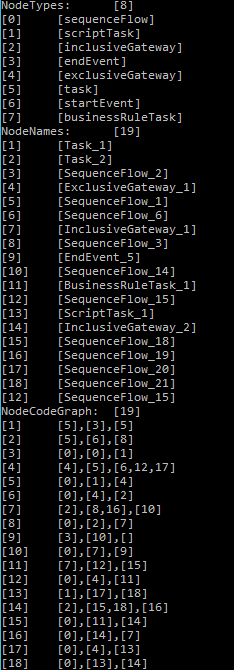

# SerentityDapp.BPMS

Business Process Management Smart Contract (BPMS)

Enacting BPMN business proceses on the blockchain

[Serentity Distributed Data Apps (serentitydapps)](https://github.com/mwherman2000/serentitydapps) Project

Part of the [SerentityData Compiler, Runtime, Graph, and Digital Ledger Standards](https://github.com/mwherman2000/serentitydata) Project

## Purpose

TODO

### Goals

TODO

### Principles

TODO

### Drivers

TODO

### How To Contribute

* To learn more about contributing to the `serentitydata` project, click 
[here](https://github.com/mwherman2000/serentitydata/blob/master/CONTRIBUTE.md).

* To contribute a new SerentyData dApp, open an issue [here] and enter all the pertient details:
    * dApp Name
    * Project URL
    * Website URL
    * Contributors
    * Contact information
        * Email addresses

## Reference Platform

* C# 7.0 and later
* .NET Core 2.0 and later
* Visual Studio 2017 Community Edition
* Distributed Ledger Technology (DLT) Platforms
    * [Stratis Platform](http://www.stratisplatform.com)
    * [Ethereum](https://www.ethereum.org/)
    * [NEO Blockchain](http://neo.org)
    * [#DIYDLT Blockchain](https://www.linkedin.com/feed/update/urn:li:activity:6414282773086949376)

## Description

TODO

## Modeler

TODO

TODO

## Cockpit

TODO

TODO

## Tasklist

TODO

TODO

## Off-chain - On-chain Integration

TODO

TODO

## SerentityDapp.BPMS Byte Encoding Example

## Resources

* [Camunda Modeler](https://camunda.com/products/modeler/)
* [Camunda Cockpit](https://camunda.com/products/cockpit/)
* [Camunda Tasklist](https://camunda.com/products/tasklist/)